  

 

  

 

<h2 align="left">Selected work</h2>

  <table>
    <tr>
      <td width="33%" valign="top">
        <strong>LoomFrog</strong>  
        Brand DNA &amp; Tone Consistency AI auditing tool I designed and launched.  
        <a href="https://kaimir-auth.github.io/LoomFrog/">View project →</a>
      </td>
      <td width="33%" valign="top">
        <strong>temcbd.com</strong>  
        Corporate website where I handled the design, structure and copywriting; built with Bolt.new and hosted on GitHub Pages.  
        <a href="https://temcbd.com/">View site →</a>
      </td>
      <td width="33%" valign="top">
        <strong>Writing</strong>  
        700+ pages of literary work, a nonfiction book on Nihilism &amp; Nietzsche in progress, and essays on Substack.  
        <a href="https://kaiservahid.substack.com/">Read →</a>
      </td>
    </tr>
  </table>

 

<picture>
  <source media="(prefers-color-scheme: dark)" srcset="https://raw.githubusercontent.com/kaimir-auth/kaimir-auth/pacman-output/pacman-contribution-graph-dark.svg?game=pacman">
  <source media="(prefers-color-scheme: light)" srcset="https://raw.githubusercontent.com/kaimir-auth/kaimir-auth/pacman-output/pacman-contribution-graph.svg?game=pacman">
  
</picture>

 

<h2 align="left">Stats</h2>

  <table>
    <tr>
      <td width="50%" valign="top">
        
      </td>
      <td width="50%" valign="top">
        
      </td>
    </tr>
    <tr>
      <td colspan="2">
        
      </td>
    </tr>
  </table>

 

<h2 align="left">Coding Languages</h2>

  <!-- REPLACE: [LANGUAGES I ACTUALLY USE] with real Devicon entries only. -->
  <code>[LANGUAGES I ACTUALLY USE]</code>

<em>Learning:</em> [PLACEHOLDER — add only languages you are actively learning.]

 

<h2 align="left">Coding Tool</h2>

  <!-- REPLACE: [TOOLS I ACTUALLY USE] with real Devicon entries only. -->
  <code>[TOOLS I ACTUALLY USE]</code>

<em>Learning:</em> [PLACEHOLDER — add only tools you are actively learning.]

 

<h2 align="left">Certifications</h2>

  
    Anthropic — Claude 101 · AI Fluency ×2 
    OpenAI Academy — 2 
    Google AI Professional Certificate 
    University of Cambridge — Cognitive Psychology 
    Harvard Business Review 
    Wesleyan — Social Psychology
  

 

<h2 align="left">Social media</h2>

  
  
  
  
  
  
  

 

Profile README for <code>kaimir-auth/kaimir-auth</code> · animated with SVG, generated with GitHub Actions.
